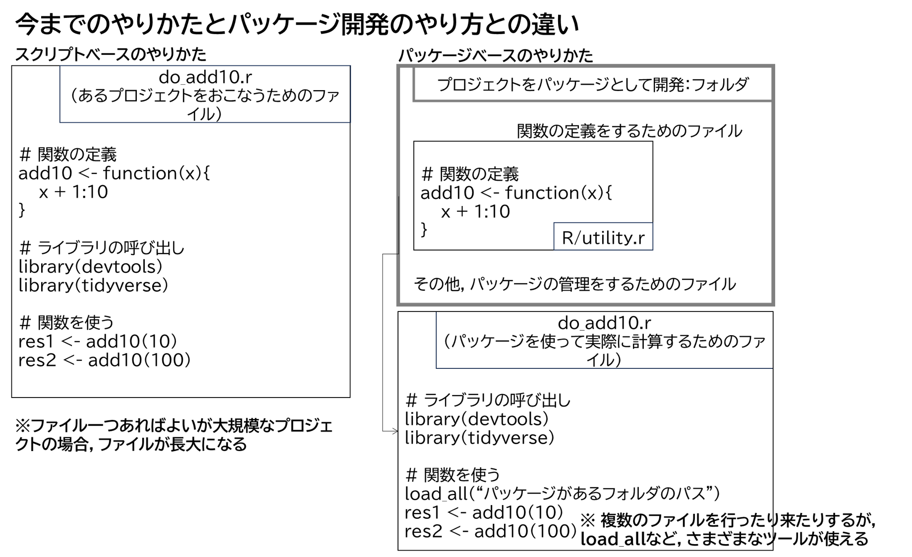

# Rパッケージ開発入門

### 第1章：はじめに
### 第2章：パッケージの構造
### 第3章：Rコード
### 第14章：自動チェック
### 第15章：リリース


担当：市野川

---

# 第1章 はじめに

---

## パッケージとは？ 
- Rにおけるパッケージとは：**コード**、**データ**、**ドキュメント**、**テスト**を一緒にバンドルするもので、簡単に他の人と共有できるもの
- パッケージにする利点：誰もが「パッケージの使い方」を知っているので、簡単に使えるし、使ってもらえる


```
# CRAN上のパッケージをインストールする
install.packages("MASS")
library(MASS)
package?MASS # パッケージ全体のhelpを表示する（用意されていないパッケージも多い）
```

```
# github上のパッケージをインストールする
devtools::install_github("ichimomo/frasyr")
library(frasyr)
package?frasyr # パッケージ全体のhelpを表示する（用意されていないパッケージも多い）
```

---

## 自分のためのパッケージ開発

コードを共有しない場合でも：「コード開発がより楽になる」という利点がある：パッケージには「規約」（テンプレート、決まり）があるから

**自分パッケージを使う利点**
- 時間が短縮できる：テンプレートに従うことで、自分のプロジェクトでのファイル構造に悩まなくてすむ（Rの関数はどこに置こう？データはどのフォルダに置こう？）
   - Rの関数：R/
   - テストコード：tests/
   - データ：data/
- 「規約」に従っていれば、さまざまな「自動化ツール」が使える
   - devtoolsのcheck, test, load_allなど
   - 例：「規約」に従った書式でファイルを作成すれば、RのhelpファイルやvignetteファイルはRの関数から自動的に作成される

--- 

## 1.1 哲学

- 開発のための処理はできるだけ「自動化」する（devtools & usethis: 一般的な開発タスクを自動化するための関数のあつまり）
- 優れたコードエディタを使おう（Rstudio, Emacs, VSCodeなど）
- 更に深く知りたい人は「Writing R extensions（https://cran.r-project.org/doc/manuals/R-exts.html）」

--- 

### 1.2 学習開始

- R, Rstudioの入手
- パッケージのインストール

```
install.packages(c("devtools","roxygen2","testthat","knitr"))

# devtoolsの開発版を使いたい人は
# devtools::install_github("hadley/devtools")
```

- Rtoolsのインストール

```
# Rtoolsがインストールされているかの確かめ
library(devtools)
has_devel()
```

```
# 自分の環境の確認
devtools::session_info()
```

---

# 2章: パッケージの構造

---


## 2.1 パッケージに名前をつける

**要件**
- 数字・文字・ピリオドだけ、文字で始まる、ピリオドで終わらない
- ハイフンやアンダースコアは不可

**おすすめすること**
- ピリオドは使わない
- 簡単にgoogleで検索でき、ユニークな名前を選ぶ（すでに使用されているかどうかはCRANやgoogleなどで検索する）
- 大文字と小文字の両方を混在させない（SPiCT？）
- 問題を連想させる単語を選び、かつユニークな言葉になるようにする
- 略語（Rcpp）を使う、最後にrを追加する

---

#### frasyr $\leftarrow$ FRA Sustainalbe Yield with R
#### frasyr23 $\leftarrow$ FRA Sustainalbe Yield with R for type 2 and 3 rule
#### frapmr $\leftarrow$ FRA Production Model with R

---

## 2.2 パッケージをまず作ってみよう :sparkles:

- Rstudioを使う場合
   1. [File] → [New Project]
   2. [New Directory]を選択
   3. [R package]を選択
   4. 名前をつけて[Create Project]をクリックする
- コマンドを使う場合（.projファイルは作成されない、Rstudioを使う場合と微妙に初期ファイルが異なるので注意）
```
devtools::create("~/test/")
```
- `package.skelton()`という関数もあるが、これは使わないこと

---

$\rightarrow$ **パッケージにとって必要な最小のコンポーネントが作成される**

1. **DESCRIPTION**：パッケージの説明を記述するファイル（必要なライブラリやパッケージの説明などを編集する）
2. **NAMESPACE**：このパッケージで定義される関数名などの設定（自動生成されるので基本的には編集しない）
3. **R/** ディレクトリ：Rの関数をこのディレクトリで定義
   - hello.Rというサンプルファイルも
4. **man/** Rのhelpとなる
   - hello.Rdというサンプルファイルも
5. **.Rbuildignore** : パッケージをビルド（インストールできる状態にする）するときに、ビルドの対象から外すファイルのリスト
6. **test.Rproj**　：　プロジェクトファイル（次スライド）

---

## 2.3 RStudioプロジェクト

- test.RprojというファイルをダブルクリックするとRstudioが立ち上がり、このファイルがおかれているディレクトリからRstudioがスタートする→それ以降「test」というプロジェクトのもとで作業が進められる
- プロジェクトを使うメリット（パッケージ開発に限らず）
   - プロジェクト間が独立している
   - 便利なコードナビゲーションツールが使える
   - 便利なキーボード・ショートカット（Alt-Shift-K）


**XXX.projファイルの構造**
- [Tools] → [Project Options] で設定された内容がここに反映される
   - Global optionが変わっても（＝別の人が作業しても）、このプロジェクト内ではいつも同じ設定で作業ができる

---

- 以下はfrasyrの設定（林さんのおすすめ）

```
Version: 1.0

RestoreWorkspace: No
SaveWorkspace: No
AlwaysSaveHistory: Default

EnableCodeIndexing: Yes
UseSpacesForTab: Yes
NumSpacesForTab: 2
Encoding: UTF-8

RnwWeave: Sweave
LaTeX: pdfLaTeX

AutoAppendNewline: Yes
StripTrailingWhitespace: Yes
LineEndingConversion: Posix

BuildType: Package
PackageUseDevtools: Yes
PackageInstallArgs: --no-multiarch --with-keep.source
PackageRoxygenize: rd,collate,namespace

```

--- 

## 2.4 様々な形態のパッケージ :sparkles:

- 2.4.1 ソースパッケージ
   - 自分のPCにある開発バージョンのパッケージ（さっき作成したフォルダ）
- 2.4.2 バンドルパッケージ
   - ソースファイル（フォルダ）を一つのファイルに圧縮したもの（.tar.gz）
   - `devtools::build()`で作成可能
   - 解凍したものはソースファイルとほぼ同じだが若干違う（.Rbuildignoreで指定されたファイルは除かれる）
   - `install.packages`や[Tools]→[Install packages (install from: Package Archive File)]からファイルを指定してインストール可能
- 2.4.3 バイナリパッケージ
   - Rパッケージ開発ツール(Rtools)を持っていない人に配布する用
   - プラットフォーム固有（Windows用、Mac用、Linux用など）
   - `devtools::build(binary=TRUE)`で作成可能
   
---

ソース・バンドル・
バイナリパッケージの
違い (2nd editionより)


---

- 2.4.4 インストール済のパッケージ
   - バイナリパッケージが解凍されたもので、自分のPCで利用する準備ができているもの


パッケージをインストールするさまざまな方法(2nd editionより)


---

### 2.4.5 インメモリパッケージ
   - パッケージを使うときに呼び出したあとのパッケージ


**パッケージの使い方のいろいろ**

```
# devtoolsというインストール済のパッケージの中のcheckという関数を使う
devtools::check()

# devtoolsというパッケージを予め呼び出しておく
library(devtools)
# requireという関数を使ってもできる
require(devtools)
# "devtools::"をつけなくてもcheckという関数が使える
check()

.libPaths() # 自分がインストールしているライブラリの一覧を表示
```

---

# The Whole Game (1st chapter, 2nd edition)
## 簡単なtoy packageを作ってみよう:sparkles::sparkles:

2.2の手順で作ったパッケージを使います

<!--

### gitを使う

```
use_git()
```

このパッケージをgithubのレポジトリとして登録する（最初に1回やれば良い）。gitのコマンドラインで
```
git remote add origin git@github.com/ichimomo/RpackDev.git
```

-->

---

### Rの関数を定義するためのファイルを作る ＆ 開く

たとえば`add10`という関数をRフォルダ以下のutility.rというファイルに書いて保存する

```
use_r("utility")
```

utility.rという新しいファイルが作成されるのでそこに

```
add10 <- function(x){
   return(x + 1:10)
}
```

というコードを追加する。

以前編集したファイルを再度開きたい場合も同じコマンドを使う

```
use_r("utility")
```

- このコマンドを使ってファイルを開く意義はよくわからない...

--- 

### さっき定義した関数を開発環境中に呼び出して（`load_all`）、ちゃんと動くか確認しよう

```
add10(100) # こんな関数はない、とエラーが出る

# load_allすると...

load_all()
add10(100) # add10という関数が使えるようになった
add10(10) 
```

add10という関数は'globalenv()'には存在しない
```
exists("add10", where=globalenv(), inherits=FALSE)
```

`source("R/utility.r")`とは挙動が異なることに注意


--- 

### パッケージのシステムを使ったワークフローの基本

**(1) 関数の開発フェーズ**
1. R/以下にある.rファイルで関数を定義＆編集
2. `load_all()` で関数を呼び出して試す
3. 1に戻る

**(2) コードの確認からリリースへ**
4. `test()`（テストコードの実施），`build_vignette()` （vignetteの作成）, `build_readme()`(Readme.mdの作成)，`document()` （helpファイルの作成）
5. `check`(リリース前の最後の確認)
6. `build()`（パッケージとしてパッキング）、または、githubへアップロード


--- 



--- 


:worried: **ファイルがたくさんあってわかりにくい*** :worried:
- パッケージの構造に従っていれば`check`や`test`など、devtoolsが提供するさまざまな機能を使うことができます

:worried: **関数実行のためのスクリプトはどこに置くの？**:worried:
スクリプトの目的によって様々です
 - 関数の動作を確認するためのスクリプト: test/testthat/以下にテストコードとして
 - 関数の使い方を紹介したり、関数の動作の例を示すためのスクリプト: vignette/ 以下にRmdファイルとして
 - 関数を使って本格的に解析を行う場合: 別のプロジェクトをたてる
   - 1A, 1B系資源：frasyr (パッケージ)、frasyr_tool(frasyrを動かすためのスクリプト集)
	- 1C資源：frapmr（パッケージ）、frapmt (frapmrを動かすためのスクリプト集)

---

### Check (14章)

コードに一般的な問題がないかを自動的にチェックする

```
check() # or devtools::check()
```

- メタデータのチェック（DESCRIPTIONの確認
- パッケージ構造の確認
- NAMESPACEの確認＆更新
- Rコードの構文等の確認
- ドキュメントの作成と確認
- テストコードの実施
- vignetteの作成

---


# 3章 Rコード

---

## 3.1 Rコードのワークフロー

開発中のRコードは

`
devtools::load_all()
`

を使って呼び出せます。またはRstudioでContrl-Shift-LでもOKです

## 3.2 関数をまとめる

- 分かりやすい形で複数の関数を一つのファイルにまとめましょう

---

## 3.3 コードスタイル

- わかりやすくコードを書きましょう。たとえば
   - https://google.github.io/styleguide/Rguide.html
   - https://style.tidyverse.org/

- コードの分かりにくさを指摘してくれるパッケージ
```
install.packages("lintr")
lintr::lint_package()
```


<!---
- "."はもう使わないこと．かわりに"_"やキャメルケースなどを用いますが，一貫した使い方をしましょう
   - plot.catch # 古いやりかた．もう使わない
   - plot_catch # "_"を使う場合
   - PlotCatch # キャメルケース
- 良いオブジェクト名をつけましょう
   - 良い例： day_one, day1
   - 悪い例：dayone, DayOne
- 既存の関数や変数の名前の使用を避けましょう

```
# 悪い例
T <- FALSE
mean <- function(x) return(sum(x))
```
---

## 3.3.2 スペース
- =, +, -, <- などの演算子の前後には必ずスペースを入れましょう（ただし:, ::, :::については不要です）

-->

---

## 3.4 トップレベルのコード (Understand when code is excecuted)


今までのやり方（スクリプトベース）とパッケージによるやり方では何が違うのか？

---

**スクリプトとパッケージの2つの大きな違い**
1. **いつコードが実行されるか**
   - **スクリプト**: コードはロードされたときに実行される（生成物はコードによって計算された結果）
   - **パッケージ**: コードはビルドされたときに実行される（生成物はたくさんの関数）
2. **パッケージが実行される環境**
   - パッケージは自分の想像ができないような場所で使われることもある．


---

### 3.4.1 コードのロード

- パッケージ定義する関数の中で`library()`，`require()`を使用しない：かわりに必要なパッケージはDESCRIPTIONで記述したり、exportしたりする（石田さんパート）
- `source()`しない ：かわり`load_all`する

---

### 3.4.2 Rの環境

Rが実行される環境は様々。パッケージ内の関数が実行されるときに、その環境まで変えてしまいたい場合もあるが、注意が必要

- `options()`（グローバルオプション）や`par()`（関数オプション）はできるだけ変更しない．どうしても変更する必要がある場合には，使い終わったあとにもとに戻す（use `on.exit`）
- 作業ディレクトリの変更は避ける．どうしても変更する必要がある場合には，処理が終わったらもとに戻す
- データの作成＆プロットするような処理はできるだけ別の関数に分ける

### 3.4.3 副作用が必要になるとき

- `.onLoad`や`.onUnload()`（パッケージがロードされたときに特定のグローバルオプションを変更する）を使いたいときには使う
